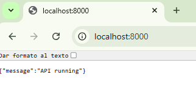
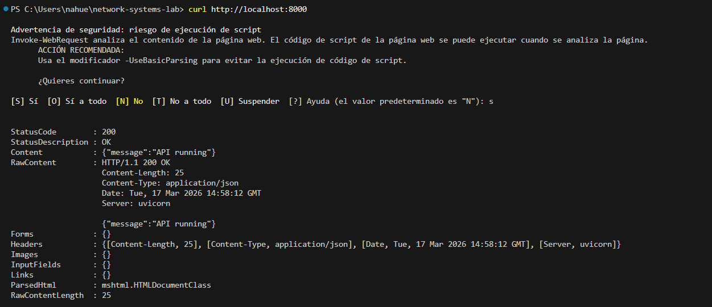
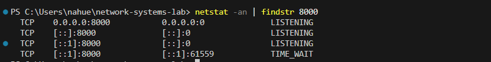
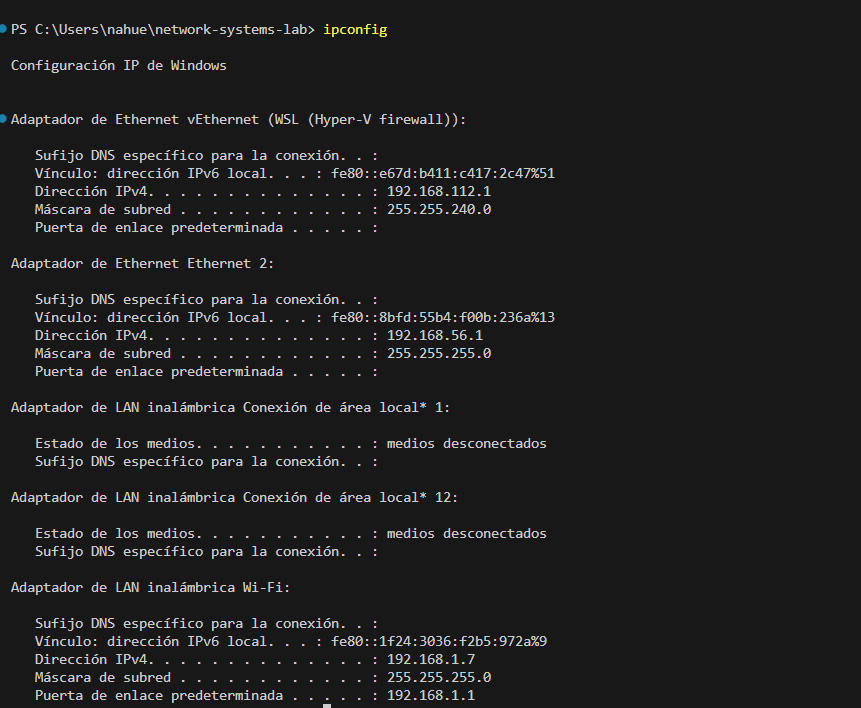
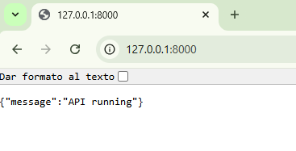

# TCP/IP Lab — Comunicación Cliente-Servidor con FastAPI y Docker

## 🎯 Objetivo

Analizar cómo se comunican cliente y servidor dentro de una red utilizando HTTP sobre TCP, observando el uso de puertos, direcciones IP y conexiones activas.

---

## 🧱 Arquitectura del experimento

Cliente (browser / curl)
↓
TCP (puerto 8000)
↓
Servidor FastAPI (Docker container)

---

## ⚙️ Tecnologías utilizadas

* FastAPI
* Docker
* Docker Compose
* curl
* netstat

---

## 🚀 Implementación

### 1. API básica

Se creó una API con FastAPI con un endpoint raíz:

```python
@app.get("/")
def root():
    return {"message": "API running"}
```

---

### 2. Contenerización

Se utilizó Docker para ejecutar la API dentro de un contenedor.

Dockerfile:

* Imagen base: python:3.12-slim
* Instalación de dependencias
* Ejecución con Uvicorn en puerto 8000

docker-compose:

* Exposición del puerto 8000

---

## 🔄 Flujo de comunicación

1. El cliente (browser/curl) realiza una request HTTP
2. Se establece una conexión TCP con el servidor (3-way handshake)
3. El servidor recibe la request en el puerto 8000
4. FastAPI procesa la solicitud
5. Se envía una respuesta HTTP al cliente
6. La conexión puede cerrarse o mantenerse (keep-alive)

---

## 🧪 Pruebas realizadas

### 🔹 1. Acceso desde localhost

Se accedió a:

http://localhost:8000

Resultado:

* La API responde correctamente
* Se confirma que el servidor está escuchando en el puerto 8000

    

* navegador mostrando la respuesta JSON

---

### 🔹 2. Acceso con curl

```bash
curl http://localhost:8000
```

Resultado:

* Se obtiene respuesta JSON desde la terminal

    

* terminal con curl + respuesta

---

### 🔹 3. Análisis de conexiones con netstat

```bash
netstat -an | findstr 8000
```

Resultado:

* Estado LISTEN → servidor esperando conexiones
* Estado ESTABLISHED → conexión activa cliente-servidor



* salida de netstat mostrando conexiones TCP

---

### 🔹 4. Acceso mediante IP local

Se obtuvo la IP con:

```bash
ipconfig
```


Luego se accedió a:

http://<IP_LOCAL>:8000

Resultado:

* Se accede desde la red local
* Se valida que no es solo localhost

    

* navegador usando IP local

---

## 🧠 Análisis técnico

* HTTP funciona sobre TCP
* El servidor escucha en un puerto específico (8000)
* El cliente establece una conexión TCP antes de enviar datos
* Docker permite exponer servicios a la red del host

---

## 🛠 Problemas encontrados

### Error con Docker COPY

Problema:
Docker no encontraba el archivo requirements.txt

Causa:
El archivo estaba dentro de la carpeta app/ pero Docker lo buscaba en el contexto raíz

Solución:
Se movió el archivo a la raíz del proyecto o se ajustó la ruta en el Dockerfile

---

## 🌐 Conceptos aplicados

- Modelo cliente-servidor
- Protocolo TCP
- Protocolo HTTP
- Uso de puertos
- Direccionamiento IP básico
- Contenerización de servicios

---

## 📌 Conclusiones

- Se comprendió el modelo cliente-servidor en la práctica
- Se verificó el uso de puertos en la comunicación
- Se observó el establecimiento de conexiones TCP
- Se validó el acceso tanto local como en red

---

## 🚀 Próximos pasos

- Analizar tráfico entre contenedores
- Simular múltiples servicios
- Introducir direccionamiento IP y subnetting
